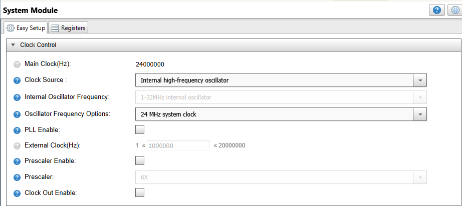
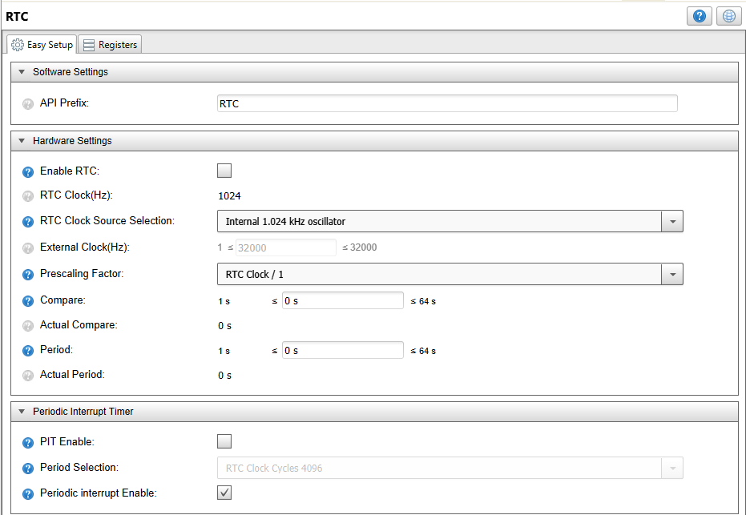
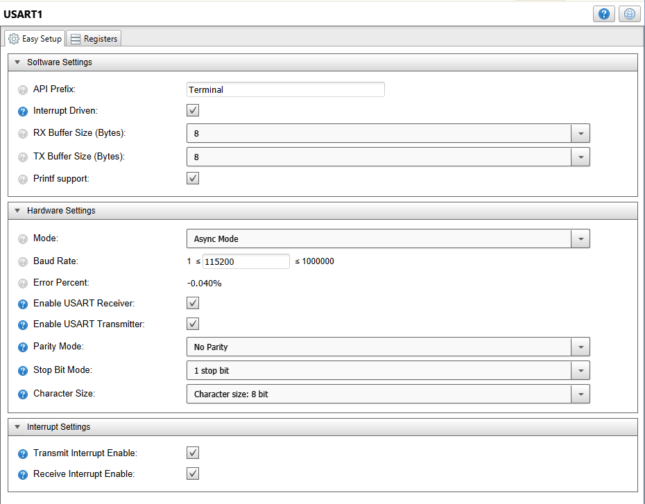
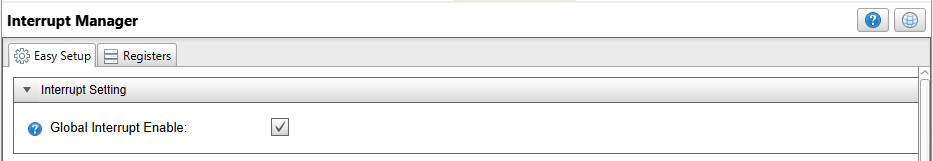
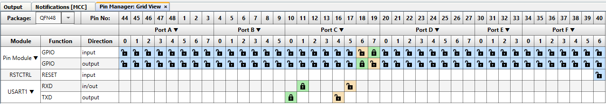
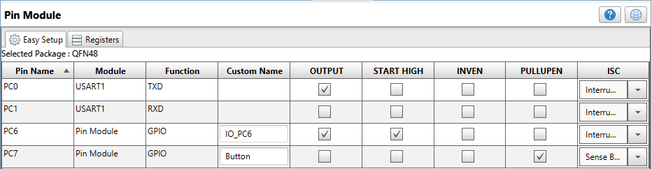
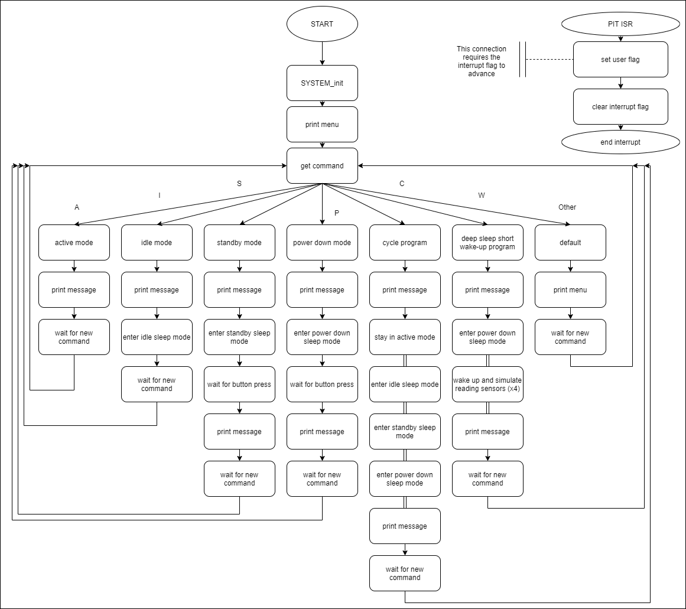

 <article class="markdown-body entry-content p-3 p-md-6" itemprop="This needs to locked down and 'never' changed">

# AVR128DA48 Sleep modes example - MCC 

This repository provides a MPLAB X IDE project with a MCC (MPLAB Code Configurator) generated code example for testing the sleep modes available to the AVR DA device. 

## Related Documentation
This code was developed for the application note [AVR DA Low Power Features and Sleep modes](). 

More details and code examples on the AVR128DA48 can be found at the following links:
- [AVR128DA48 Product Page](https://www.microchip.com/wwwproducts/en/AVR128DA28)
- [AVR128DA48 Code Examples on GitHub](https://github.com/microchip-pic-avr-examples?q=avr128da48)
- [AVR128DA48 Project Examples in START](https://start.atmel.com/#examples/AVR128DA48CuriosityNano)

## Software Used
- MPLAB® X IDE 5.40 or newer [(microchip.com/mplab/mplab-x-ide)](http://www.microchip.com/mplab/mplab-x-ide)
- MPLAB® XC8 2.20 or newer [(microchip.com/mplab/compilers)](http://www.microchip.com/mplab/compilers)
- MPLAB® Code Configurator (MCC) 3.95.0 or newer [(microchip.com/mplab/mplab-code-configurator)](https://www.microchip.com/mplab/mplab-code-configurator)
- AVR-Dx_DFP 1.4.75 or newer Device Pack
- 8-bit AVR MCUs Lib version 2.3.0
- Terminal software installed on a computer (Hercules, TerraTerm etc.)

## Hardware Used
- AVR128DA48 Curiosity Nano [(DM164151)](https://www.microchip.com/Developmenttools/ProductDetails/DM164151)

## Setup
The AVR128DA48 Curiosity Nano Development Board is used as test platform.
 

The following MCC configurations must be made for this project:

 - System Module
    1. Internal Oscillator (24 MHz)
    2. Prescaler disabled
    3. WDT disabled

 

- RTC 
	1. Clock source: Internal 1.024 kHz oscillator
	2. Periodic Interrupt Timer enabled
	3. Overflow Interrupt disabled
	
 	
	
- USART
	1. USART instance USART1
	2. API Prefix: Terminal
	3. Interrupt driven checked
	4. Printf support checked
	5. Baud rate: 115200
	6. Transmit Interrupt enabled
	7. Receive Interrupt enabled

 	
	
- Interrupt Manager
	1. Enable Global Interrupts
	
 	

- Pin Manager
    1. PC0 as USART output (TXD)
	2. PC1 as USART input (RXD)
	3. PC6 set as output and Start High
	4. PC7 named "Button" set as input with Pull up enabled and Interrupt on Sense both edges

 
 

## Demo Code 

The source code for this project can be downloaded from the current page by clicking the "Download" button. It is recommended to use the provided code as the main.c file contains a lot of user edited lines of code.
 - After making the MCC settings, press the "Generate" button, and this will generate the required .c and .h files.
 - The resulting code was edited in the pin_manager.c file to set all unused pins as output. 
    
The flow diagram is presented in the picture below:

 

## Operation

1. Connect the AVR128DA48 Curiosity Nano Development Board to PC using the USB cable.
2. Build the firmware and load the generated hex file into MCU.  

## Demo:

After the code has been compiled and loaded onto the device, open the Terminal software, establish a connection and reset the board. A menu will appear that describes the various commands that can be sent.  

## Summary
This example represents a way to test the sleep mode operation of the AVR DA device. 